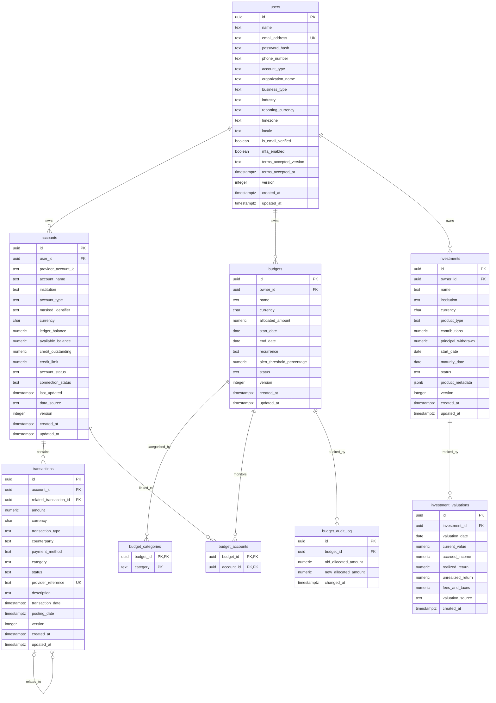

# Entity Relationship Diagram (ERD) - SmartMoney Intelligence

This document outlines the database architecture and entity relationships for the **SmartMoney Intelligence** platform based on the DDL definitions located in the [`database_schema/`](file:///home/frank/SmartMoney_intelligence/database_schema) directory.

---

## 1. Visual Entity Relationship Diagram

---

## 2. Table Relationships & Cardinality

| Parent Table | Relationship | Child Table | Foreign Key | Cardinality | Delete / Update Rules & Behavior |
| :--- | :---: | :--- | :--- | :---: | :--- |
| `users` | 1 &rarr; N | `accounts` | `accounts.user_id` &rarr; `users.id` | 1 to 0..* | A user can register multiple bank or credit accounts across supported institutions (KCB, NCBA, Stanbic, Equity). |
| `users` | 1 &rarr; N | `budgets` | `budgets.owner_id` &rarr; `users.id` | 1 to 0..* | A user can create and manage multiple budgets (e.g., monthly expenses, departmental budgets). |
| `users` | 1 &rarr; N | `investments` | `investments.owner_id` &rarr; `users.id` | 1 to 0..* | A user can maintain multiple investment portfolios or products (fixed deposit, treasury, funds, equity). |
| `accounts` | 1 &rarr; N | `transactions` | `transactions.account_id` &rarr; `accounts.id` | 1 to 0..* | Every financial transaction is associated with a specific parent financial account. |
| `transactions` | 1 &rarr; N | `transactions` | `transactions.related_transaction_id` &rarr; `transactions.id` | 0..1 to 0..* | Self-referencing link supporting transaction lineage, refunds, reversals, and adjustments. |
| `budgets` | 1 &rarr; N | `budget_categories` | `budget_categories.budget_id` &rarr; `budgets.id` | 1 to 0..* | `ON DELETE CASCADE`. Multi-category coverage per budget. |
| `budgets` | M &rarr; N | `accounts` | Via `budget_accounts` bridge table | M to N | `ON DELETE CASCADE` for both `budget_id` & `account_id`. Associates specific bank accounts to budgets. |
| `budgets` | 1 &rarr; N | `budget_audit_log` | `budget_audit_log.budget_id` &rarr; `budgets.id` | 1 to 0..* | Automated audit log driven by trigger `trigger_budget_allocation_audit` whenever `allocated_amount` is updated. |
| `investments` | 1 &rarr; N | `investment_valuations` | `investment_valuations.investment_id` &rarr; `investments.id` | 1 to 0..* | Daily valuation snapshots recording current value, yield, fees, and returns. Has a `UNIQUE(investment_id, valuation_date)` constraint. |

---

## 3. Database Schema Overview & Entity Definitions

### 3.1. User Management
* **Source:** [`users.sql`](file:///home/frank/SmartMoney_intelligence/database_schema/users.sql)
* **Table:** `users`
* **Purpose:** Core identity table supporting both `INDIVIDUAL` and `ORGANIZATION` customer types.
* **Key Fields:**
  * `id`: UUID primary key (`gen_random_uuid()`).
  * `email_address`: Unique email constraint (`users_email_unique`).
  * `account_type`: Enum-like check (`INDIVIDUAL`, `ORGANIZATION`).
  * `organization_name`, `business_type`, `industry`: Nullable fields populated for business profiles.
  * `reporting_currency`, `timezone`, `locale`: Regional localization preferences.
  * `is_email_verified`, `mfa_enabled`: Security posture flags.
  * `terms_accepted_version`, `terms_accepted_at`: Legal compliance tracking.
  * `version`: Optimistic locking field for JPA/Hibernate concurrency control.

### 3.2. Banking & Accounts
* **Source:** [`accounts.sql`](file:///home/frank/SmartMoney_intelligence/database_schema/accounts.sql)
* **Table:** `accounts`
* **Purpose:** Manages aggregated financial accounts linked via bank integrations or manual entry.
* **Key Fields:**
  * `id`: UUID primary key.
  * `user_id`: Foreign key referencing `users(id)`.
  * `institution`: Restrained to `('KCB', 'NCBA', 'STANBIC', 'EQUITY')`.
  * `provider_account_id`: External identifier from the banking provider.
  * `account_type`: `DEPOSIT` or `CREDIT`.
  * `ledger_balance`, `available_balance`, `credit_outstanding`, `credit_limit`: High-precision balances (`NUMERIC(19,4)`).
  * `account_status`: `ACTIVE`, `CLOSED`, `RESTRICTED`.
  * `connection_status`: `CONNECTED`, `SYNCING`, `DISCONNECTED`, `ACTION_REQUIRED`.
  * `data_source`: `BANK_API` or `MANUAL`.
  * Unique constraint on `(institution, provider_account_id)` to prevent duplicate integrations.

### 3.3. Transaction Ledgers
* **Source:** [`transactions.sql`](file:///home/frank/SmartMoney_intelligence/database_schema/transactions.sql)
* **Table:** `transactions`
* **Purpose:** Records debits, credits, transfers, and charges.
* **Key Fields:**
  * `id`: UUID primary key.
  * `account_id`: Foreign key referencing `accounts(id)`.
  * `related_transaction_id`: Nullable self-referencing foreign key pointing to `transactions(id)` for tracking refunds and reversals.
  * `amount`: Positive financial amount (`NUMERIC(19,4)`).
  * `transaction_type`: `CREDIT` or `DEBIT`.
  * `status`: `PENDING`, `POSTED`, `FAILED`, `REVERSED`, `CANCELLED`.
  * `provider_reference`: Unique external reference.
  * `transaction_date`, `posting_date`: Temporal split for real-time transaction event vs. settlement posting.
* **Indexes:**
  * `idx_transactions_account_date (account_id, transaction_date DESC)`
  * `idx_transactions_status (status)`

### 3.4. Budgeting System
* **Source:** [`budgets.sql`](file:///home/frank/SmartMoney_intelligence/database_schema/budgets.sql)
* **Tables:**
  * **`budgets`**: Defines budget envelopes, spending limits, duration, recurrence (`NONE`, `DAILY`, `WEEKLY`, `MONTHLY`, `YEARLY`), and alert thresholds.
  * **`budget_categories`**: Child table defining which spending categories fall under the budget (`PRIMARY KEY (budget_id, category)`).
  * **`budget_accounts`**: Bridge table associating accounts with a budget (`PRIMARY KEY (budget_id, account_id)`).
  * **`budget_audit_log`**: Historical log tracking changes to `allocated_amount`.
* **Triggers & Functions:**
  * `log_budget_allocation_change()`: PL/pgSQL function triggered `AFTER UPDATE ON budgets` whenever `allocated_amount` changes, inserting historical records into `budget_audit_log`.

### 3.5. Investment Portfolios
* **Source:** [`investments.sql`](file:///home/frank/SmartMoney_intelligence/database_schema/investments.sql)
* **Tables:**
  * **`investments`**: Manages assets such as Fixed Deposits, Treasury Bills/Bonds, Unit Trusts/Funds, and Equities.
    * `owner_id`: Foreign key referencing `users(id)`.
    * `product_type`: `FIXED_DEPOSIT`, `TREASURY`, `FUND`, `EQUITY`, `OTHER`.
    * `contributions`, `principal_withdrawn`: Capital movement tracking.
    * `product_metadata`: JSONB column indexed with GIN (`idx_investments_metadata`) to store polymorphic asset traits (e.g. units held, coupon rates, yield).
  * **`investment_valuations`**: Historical time-series valuation points for each investment.
    * `investment_id`: Foreign key referencing `investments(id)`.
    * `valuation_date`: Date of the valuation snapshot.
    * `current_value`, `accrued_income`, `realized_return`, `unrealized_return`, `fees_and_taxes`.
    * `valuation_source`: `PROVIDER`, `MARKET_FEED`, `CALCULATION`, `MANUAL`.
    * `UNIQUE (investment_id, valuation_date)`: Prevents multiple valuation records for the same investment on the same day.

---

## 4. Pending / Placeholder Schema Modules

The following files are present in [`database_schema/`](file:///home/frank/SmartMoney_intelligence/database_schema) but currently contain no table definitions:
- [`audit_logs.sql`](file:///home/frank/SmartMoney_intelligence/database_schema/audit_logs.sql): Global audit log placeholder.
- [`financial_data.sql`](file:///home/frank/SmartMoney_intelligence/database_schema/financial_data.sql): External feed/market financial data placeholder.
- [`notifications.sql`](file:///home/frank/SmartMoney_intelligence/database_schema/notifications.sql): Alerts and notifications placeholder.
